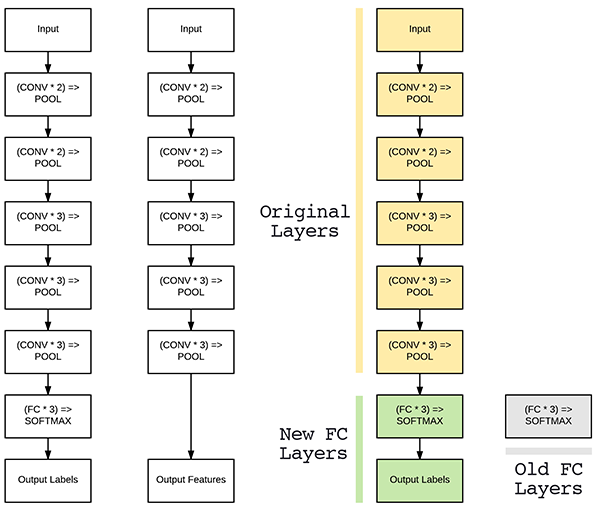
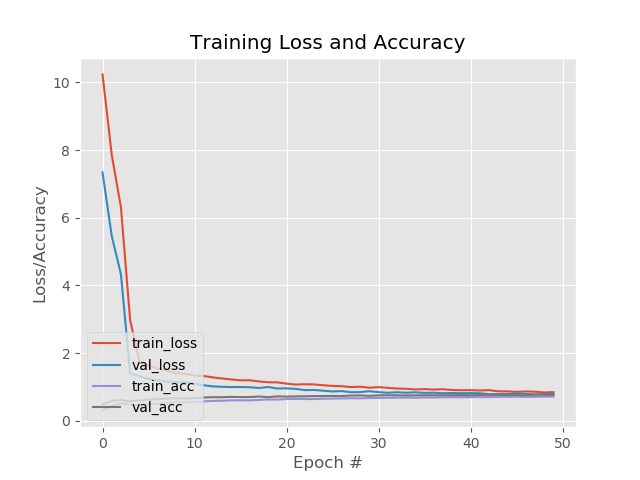
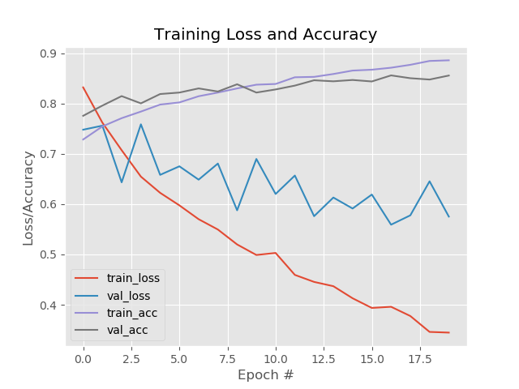
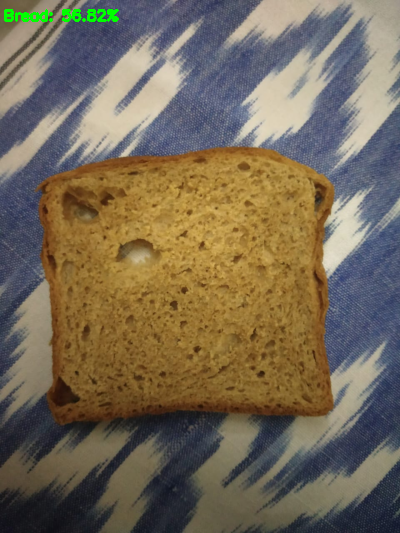

# Food-11-Classifier
Fine Tuned VGG16 model to train on Food-11 dataset.
pre-trained networks (such as ones trained on the ImageNet dataset) contain rich, discriminative filters. The filters can be used on datasets to predict class labels outside the ones the network has already been trained on.
However, instead of simply applying feature extraction, we are going to perform network surgery and modify the actual architecture so we can re-train parts of the network.
One can Find the dataset in Kaggle.com as Food-11 dataset.

Warm up newly connected FC layers by training the model with the old layers of model freezed so that imagenet weights do not changed until FC layers Warm up.

After the training is Completed, unfreeze the final block of Convolutional Layer in Model and re-train as the weights of FC Layers are updated to dataset rather than being initialized randomly.

After Evaluating the Final model after training. The Final evaluation on the Test set gave an overall accuracy precision score of 87%.

open EvaluationReport.json to see the full report.

output predicted by the model on own image.
Model plot pc: PyImageSearch
